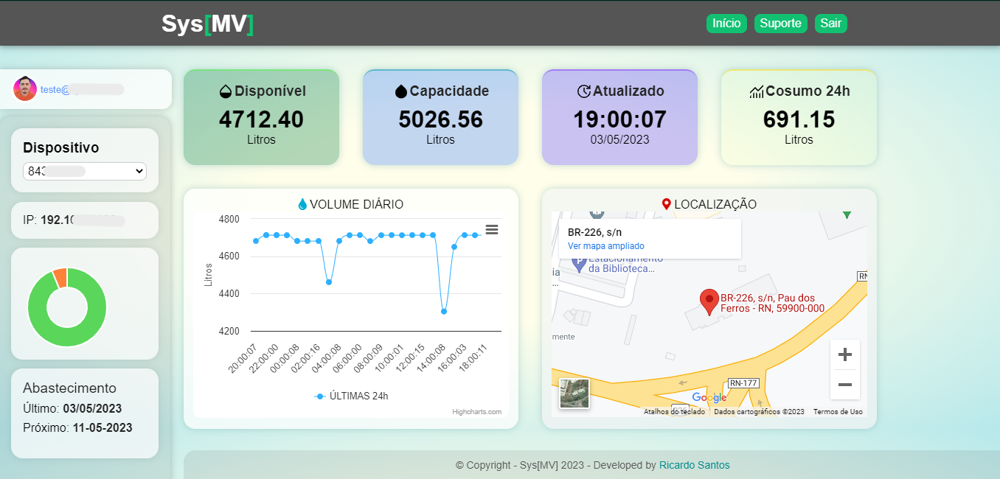
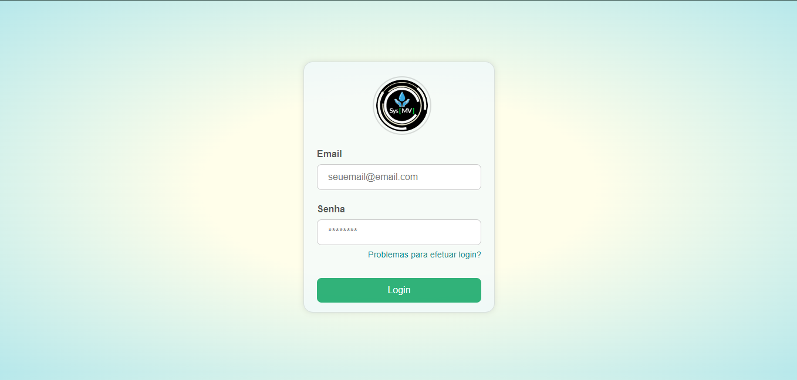
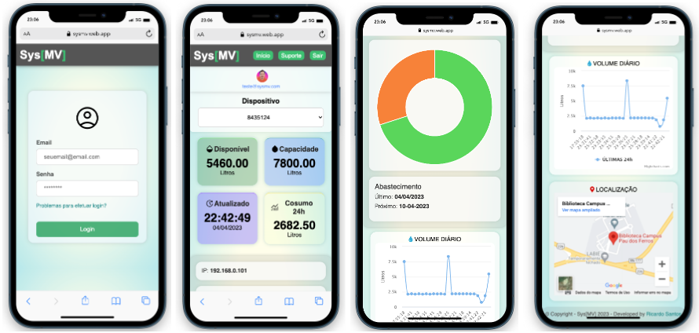

# DASHBOARD EM HTML, CSS E JS PARA ESP8266/ESP32

    

# ATENÇÃO
# "Fica expressamente proibido, em qualquer circunstância, o uso comercial deste projeto sem a devida autorização por escrito da minha parte. Qualquer utilização para fins lucrativos sem a minha prévia autorização constitui violação dos direitos autorais e pode sujeitar o infrator às penalidades legais previstas em lei."

- Esse projeto pode ser usado exclusivamente para fins educacionais.

# Capturas de tela

    
    
    

## Descrição e objetivos
### Descrição

- Este projeto está sendo desenvolvido como parte de um projeto de **TCC**
 **UFERSA** - Universidade Federal Rural do Semi-Arido

- Neste repositório, estará o código da página web da parte do "dashboard". Por questões de segurança, o código completo com todas as funcionalidades está em um repositório privado. Caso tenha alguma dúvida, pode entrar em contato.

### Objetivos
- Desenvolver uma página web no estilo dashboard para receber dados de uma placa NodeMCU/Esp8266.
- Criar uma página web com cards e gráficos que exibam informações sobre um reservatório ou cisterna.
- Incluir um campo de seleção de dispositivo para cada reservatório na página web.
- Exibir os campos de dados relevantes de acordo com o dispositivo selecionado.
- Acessar os dados a partir de um banco de dados realtime do Firebase.

### Instruções

- É necessário editar o arquivo auth.js com as credenciais do seu projeto.
- Foi usado o sistema de altentica;áo do firebase, crie um usuario com email/senha no seu projeto para acessar o dashboard
- O único arquivo de estilos CSS que está sendo utilizado é o style.css. Os outros arquivos foram criados para testes de outras estilizações, mas não foram concluídos por falta de tempo.
- O sketch do ESP8266 não está sendo disponibilizado aqui, pois é uma parte crucial do projeto de TCC. Portanto, você deve usar seu próprio sketch e adaptar a dashboard às suas necessidades.
- A pasta readme nao faz parte do projeto, é apenas para colocar as imagens desse repositório.

## Historico do codigo

 Para garantir a segurança do projeto e evitar a exposição das chaves do Firebase, todo o histórico de commits foi mantido no repositório original. Isso significa que você pode encontrar o histórico completo de alterações e melhorias realizadas no projeto até o momento. No entanto, é importante ressaltar que as chaves do Firebase fazem parte do projeto e, portanto, é fundamental manter sua privacidade e segurança. Por isso, recomendamos que você não as compartilhe ou as exponha publicamente em nenhum momento. Se precisar de mais informações sobre como utilizar as chaves do Firebase de maneira segura, recomendamos consultar a documentação oficial da plataforma.

## Tecnologias
- C/C++
- Arduino
- HTML 5
- CSS 3
- Javascript
